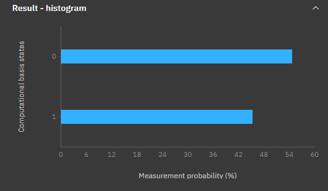

# Quantum Coin Toss

<p>A basic and experimental introduction to quantum computing. This program serves to simulate a fair coin toss by utilizing the quantum superposition of a single qubit in order to determine a random result with 50% probability of each outcome.</p>

<p>This is a python program and makes use of the Qiskit library in order to execute quantum operations. Using Qiskit we are able to run the quantum operations on both simulated hardware, as well as real hardware available within the IBM Quantum platform.</p>

<p>This program can be run on the cloud via IBM Quantum Lab using the provided Jupyter notebook. It can also be run locally by installing Python and Qiskit. To run locally you will need an IBM Quantum account. <a href="https://qiskit.org/documentation/getting_started.html">Click here for a more detailed guide.</a></p>

## Running On Simulated Hardware
Here is the code to simulate a coin toss using a single qubit. By executing this code as is, we can simulate a single-qubit quantum circuit locally without the need for real quantum hardware. This program will result in a single output and will report a win or a loss depending on the player's choice.
```python
from qiskit import *
from qiskit.providers.aer import QasmSimulator

playerChoice = 0 # Heads
#playerChoice = 1 # Tails

backend = QasmSimulator()

# Setup quantum circuit.
circuit = QuantumCircuit(1, 1)
circuit.h(0)
circuit.measure([0], [0])
compiledCircuit = transpile(circuit, backend)

# Execute circuit.
job = backend.run(compiledCircuit, shots=1)

# Process results.
result = job.result()
counts = result.get_counts(compiledCircuit)

# Print result.
if '0' in counts.keys():
    # Measurement is heads.
    if playerChoice == 0: print("Heads. You win.")
    else: print ("Heads. You lose.")

else:
    # Measurement is tails.
    if playerChoice == 0: print ("Tails. You lose.")
    else: print ("Tails. You win.")
 
```
## Quantum Circuit
The resulting quantum circuit of the above program is very simple. We can view a visual representation of the circuit with the following command
```Python
# Draw circuit
circuit.draw()
```


As we can see from the image, our circuit consists of two parts. First we define a qubit (q). We then execute a quantum operation to put the qubit into a quantum superposition state, this is denoted by H. After putting the qubit into the superposition state, we observe its value and write the value into a constant (C). Now that the qubit value has been observed, it is no longer in a superposition state and its value will remain constant. Its value will determine whether our coin toss landed on heads or tails.

## Running On Real Hardware
To run the program on real quantum hardware, we will need to make a few minor modifications. First, let us see what IBM quantum computer backends we have available to us.

```Python
# Access real hardware
from qiskit import IBMQ
IBMQ.load_account()
provider = IBMQ.get_provider(hub='ibm-q')
for backend in provider.backends():
    print(backend.status().to_dict())
```

This gives us the following:

```Python
{'backend_name': 'ibmq_qasm_simulator', 'backend_version': '0.1.547', 'operational': True, 'pending_jobs': 7, 'status_msg': 'active'}
{'backend_name': 'ibmq_armonk', 'backend_version': '2.4.35', 'operational': True, 'pending_jobs': 49, 'status_msg': 'active'}
{'backend_name': 'ibmq_santiago', 'backend_version': '1.4.3', 'operational': True, 'pending_jobs': 248, 'status_msg': 'active'}
{'backend_name': 'ibmq_bogota', 'backend_version': '1.6.41', 'operational': True, 'pending_jobs': 272, 'status_msg': 'active'}
{'backend_name': 'ibmq_lima', 'backend_version': '1.0.36', 'operational': True, 'pending_jobs': 261, 'status_msg': 'active'}
{'backend_name': 'ibmq_belem', 'backend_version': '1.0.42', 'operational': True, 'pending_jobs': 217, 'status_msg': 'internal'}
{'backend_name': 'ibmq_quito', 'backend_version': '1.1.30', 'operational': True, 'pending_jobs': 202, 'status_msg': 'active'}
{'backend_name': 'simulator_statevector', 'backend_version': '0.1.547', 'operational': True, 'pending_jobs': 7, 'status_msg': 'active'}
{'backend_name': 'simulator_mps', 'backend_version': '0.1.547', 'operational': True, 'pending_jobs': 7, 'status_msg': 'active'}
{'backend_name': 'simulator_extended_stabilizer', 'backend_version': '0.1.547', 'operational': True, 'pending_jobs': 7, 'status_msg': 'active'}
{'backend_name': 'simulator_stabilizer', 'backend_version': '0.1.547', 'operational': True, 'pending_jobs': 8, 'status_msg': 'active'}
{'backend_name': 'ibmq_manila', 'backend_version': '1.0.30', 'operational': True, 'pending_jobs': 175, 'status_msg': 'active'}
```
For this demo, I have chosen to run the program on IBM's quantum computer in Armonk, New York. To do so, we can run the following:

```Python
real_device = provider.get_backend('ibmq_armonk')
job = real_device.run(transpile(circuit, real_device), shots=10000)
result = job.result()
```

We could have run the program once for a single coin toss. But to test the fairness of the coin toss, I have run the program 10000 times. After the job has been run the set number of times, we are given a histogram with the probability of each outcome. Here is the histogram I got when running on the Armonk quantum computer:



From the image, we can see that our results resulted in 0 (Heads) approximately 55% of the time, and 1 (Tails) approximately 45% of the time. It is safe to assume that if we were to run this program more times, our result for each outcome would approach 50%, thus would be considered a fair coin toss. 
